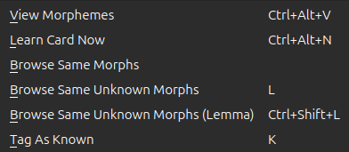

# Changes To Anki

After installing AnkiMorphs you will find that some changes have been made to Anki.

## Toolbar

The toolbar now has three new items:

- [Recalc](../usage/recalc.md)
- `L`, which stands for `Known Morph Lemmas`
- `I`, which stands for `All Morph Inflections`

  
English examples of L and I

<blockquote>

**Each column in the table contains a morph lemma, and every row in a column contains a different inflection of that lemma.**

Knowing the morph in the highlighted cell below would give you L: 1 and I: 1

<table>
    <colgroup>
    <col>
    <col>
    <col>
  </colgroup>
<tr>
    <td>go</td>
    <td>break</td>
    <td>read</td>
    <td>walk</td>
</tr>
<tr>
    <td>went</td>
    <td>broke</td>
    <td>read</td>
    <td>walked</td>
</tr>
<tr>
    <td>going</td>
    <td class="morph-variation-selected_cell">breaking</td>
    <td>reading</td>
    <td>walking</td>
</tr>
<tr>
    <td>gone</td>
    <td>broken</td>
    <td>read</td>
    <td>walked</td>
</tr>
</table>

Knowing the morphs in the highlighted cells below would give you L: 1 and I: 2

<table>
    <colgroup>
    <col>
    <col>
    <col>
  </colgroup>
<tr>
    <td>go</td>
    <td class="morph-variation-selected_cell">break</td>
    <td>read</td>
    <td>walk</td>
</tr>
<tr>
    <td>went</td>
    <td>broke</td>
    <td>read</td>
    <td>walked</td>
</tr>
<tr>
    <td>going</td>
    <td class="morph-variation-selected_cell">breaking</td>
    <td>reading</td>
    <td>walking</td>
</tr>
<tr>
    <td>gone</td>
    <td>broken</td>
    <td>read</td>
    <td>walked</td>
</tr>
</table>

Knowing the morphs in the highlighted cells below would give you L: 2 and I: 3

<table>
    <colgroup>
    <col>
    <col>
    <col>
  </colgroup>
<tr>
    <td>go</td>
    <td class="morph-variation-selected_cell">break</td>
    <td>read</td>
    <td>walk</td>
</tr>
<tr>
    <td>went</td>
    <td>broke</td>
    <td>read</td>
    <td class="morph-variation-selected_cell">walked</td>
</tr>
<tr>
    <td>going</td>
    <td class="morph-variation-selected_cell">breaking</td>
    <td>reading</td>
    <td>walking</td>
</tr>
<tr>
    <td>gone</td>
    <td>broken</td>
    <td>read</td>
    <td>walked</td>
</tr>
</table>

 
</blockquote>

  
Japanese examples of L and I

<blockquote>

**Each column in the table contains a morph lemma, and every row in a column contains a different inflection of that lemma.**

Knowing the morph in the highlighted cell below would give you L: 1 and I: 1

<table>
    <colgroup>
    <col>
    <col>
    <col>
  </colgroup>
<tr>
    <td>ない</td>
    <td>物</td>
    <td>奴</td>
    <td>出</td>
</tr>
<tr>
    <td>ねぇ</td>
    <td>もの</td>
    <td>やつ</td>
    <td>出る</td>
</tr>
<tr>
    <td>ね</td>
    <td class="morph-variation-selected_cell">もん</td>
    <td>ヤツ</td>
    <td>出よう</td>
</tr>
</table>

Knowing the morphs in the highlighted cells below would give you L: 1 and I: 2

<table>
    <colgroup>
    <col>
    <col>
    <col>
  </colgroup>
<tr>
    <td>ない</td>
    <td class="morph-variation-selected_cell">物</td>
    <td>奴</td>
    <td>出</td>
</tr>
<tr>
    <td>ねぇ</td>
    <td>もの</td>
    <td>やつ</td>
    <td>出る</td>
</tr>
<tr>
    <td>ね</td>
    <td class="morph-variation-selected_cell">もん</td>
    <td>ヤツ</td>
    <td>出よう</td>
</tr>
</table>

Knowing the morphs in the highlighted cells below would give you L: 2 and I: 3

<table>
    <colgroup>
    <col>
    <col>
    <col>
  </colgroup>
<tr>
    <td>ない</td>
    <td class="morph-variation-selected_cell">物</td>
    <td>奴</td>
    <td>出</td>
</tr>
<tr>
    <td>ねぇ</td>
    <td>もの</td>
    <td>やつ</td>
    <td class="morph-variation-selected_cell">出る</td>
</tr>
<tr>
    <td>ね</td>
    <td class="morph-variation-selected_cell">もん</td>
    <td>ヤツ</td>
    <td>出よう</td>
</tr>
</table>

 
</blockquote>

The `L` and `I` numbers are updated after every [Recalc](../usage/recalc.md).

> **Note**: Chinese and other languages that don't have inflections will result in `L` and `I` having equal numbers.

## Browse

AnkiMorphs adds new options in the `Browse` window

These options can be accessed either from the context menu when right-clicking cards, or from the `AnkiMorphs` menu at
the top of the `Browse` window:

These features are explained [here](../usage/browser.md).

## Tools Menu

An AnkiMorphs submenu is added to the Anki `Tools` menu:

You can find info about the options here:

* [Settings](../setup/settings.md)
* [Recalc](../usage/recalc.md)
* [Generators](../usage/generators.md)
* [Progression](../usage/progression.md)
* [Reset Tags](../usage/reset_tags.md)
* [Known Morphs Exporter](../usage/known-morphs-exporter.md)
